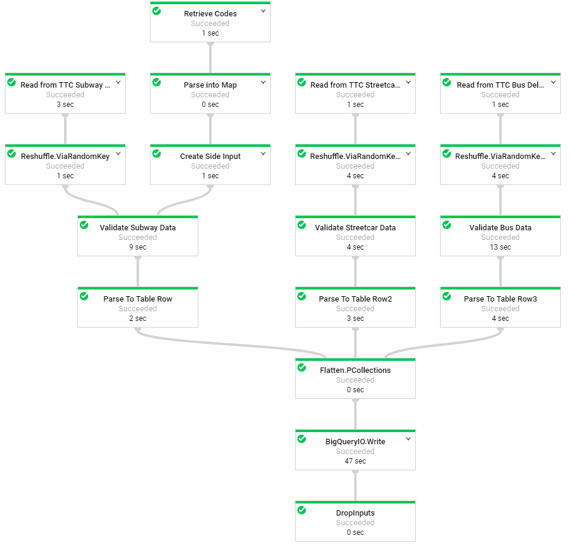

# Dataflow Batch Demo

## Background

The purpose of this demo is to demonstrate the Dataflow’s batch capability. It references TTC delay data stored on Google Cloud Storage that has been reformatted and converted to CSV prior to Dataflow ingestion.  Dataflow will produce the necessary ETL processes on each data source, collect the data as one bundle, and create a BigQuery table. 

### TTC Delay Data

The city of Toronto has provided delay information of TTC transits on their open data wepbage. Please reference the links below to learn more about each data source:
* [Subway](https://www.toronto.ca/city-government/data-research-maps/open-data/open-data-catalogue/transportation/#917dd033-1fe5-4ba8-04ca-f683eec89761)
* [Street Car](https://www.toronto.ca/city-government/data-research-maps/open-data/open-data-catalogue/transportation/#e8f359f0-2f47-3058-bf64-6ec488de52da)
* [Bus](https://www.toronto.ca/city-government/data-research-maps/open-data/open-data-catalogue/transportation/#bb967f18-8d90-defc-2946-db3543648bd6)

## Google Cloud Services Utilized
* Cloud Dataflow
* Cloud BigQuery
* Cloud Storage
* Cloud Identity and Access Management (IAM)

## Dataflow View

